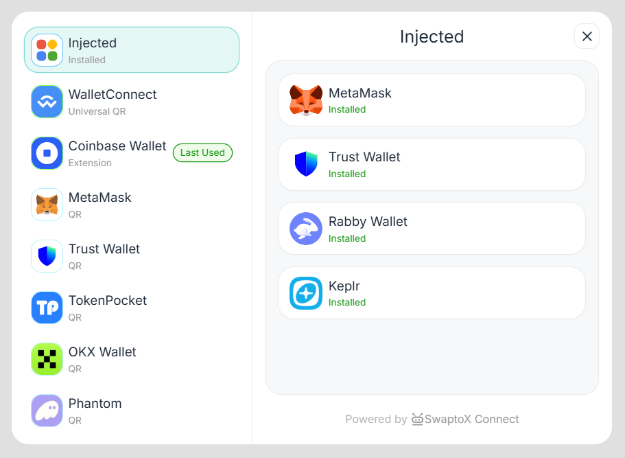
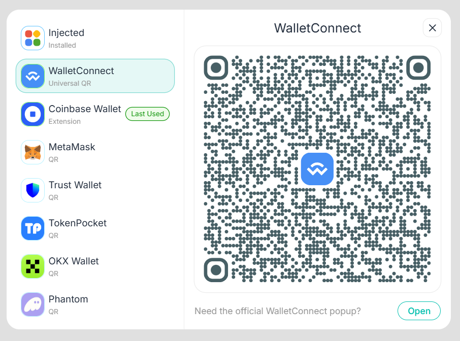
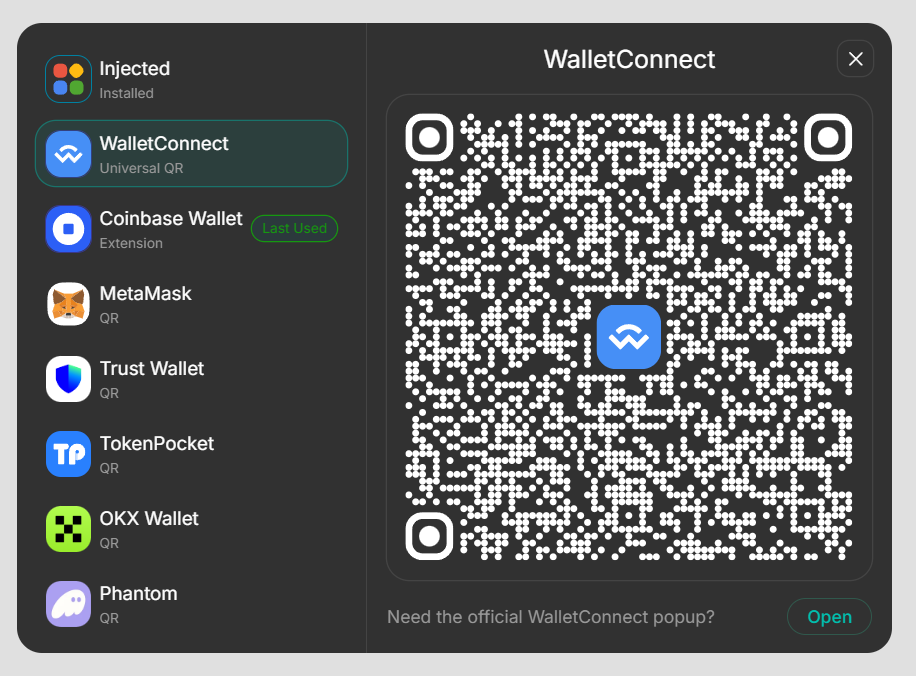

# SwaptoX Connect

SwaptoX Connect is a wallet connection SDK for EVM applications. It contains:

- `@swaptox/connect-core`: wallet connection, WalletConnect, chain switching, auto connect, and pre-transaction connection checks.
- `@swaptox/connect-ui`: Lit-based wallet modal UI that can be used from any frontend framework.
- `playground`: local demo page for testing the SDK.

## Preview





If local images are unavailable, use:

- https://cdn.swaptox.com/assets/swaptox-connect/1.png
- https://cdn.swaptox.com/assets/swaptox-connect/2.png
- https://cdn.swaptox.com/assets/swaptox-connect/3.png

## Installation

```bash
pnpm add @swaptox/connect-ui viem @walletconnect/ethereum-provider @coinbase/wallet-sdk qr-code-styling
```

Core-only usage:

```bash
pnpm add @swaptox/connect-core viem @walletconnect/ethereum-provider @coinbase/wallet-sdk qr-code-styling
```

## UI Usage

```ts
import { createConnect } from '@swaptox/connect-ui';

const connect = createConnect(
  {
    projectId: 'YOUR_WALLETCONNECT_PROJECT_ID',
    chains: ['base', 'rootstock'],
    currentChain: 'base',
    metadata: {
      name: 'Your App',
      description: 'Your App Description',
      url: 'https://example.com',
      logo: 'https://example.com/logo.png',
    },
    rpcMap: {},
  },
  {
    theme: 'light', // light | dark
    lang: 'en', // en | zh-Hans | zh-Hant | ja | ko
  },
);

connect.on('connect', data => console.log('connected', data));
connect.on('disconnect', error => console.log('disconnected', error));
connect.on('accountsChanged', accounts => console.log('accounts', accounts));
connect.on('chainChanged', chainId => console.log('chain', chainId));

connect.open();
```

### Pre-transaction Check

Run `checkConnect()` before sending a transaction. It verifies the current account, checks the current chain, switches to the configured chain if needed, and throws after disconnecting when the wallet is invalid.

```ts
async function sendTransaction() {
  const connection = await connect.checkConnect();
  console.log(connection.accounts[0]);

  // Send your transaction with connection.provider
}
```

### UI API

```ts
connect.open();
connect.close();
connect.autoConnect();
connect.checkConnect();
connect.disconnect();
connect.updateConfig({ currentChain: 'rootstock' });
connect.getProvider();
connect.getState();
connect.setTheme('dark');
connect.setLang('zh-Hans');
connect.on('connect', callback);
connect.off('connect', callback);
connect.destroy();
```

## Core Usage

Use core when you want to build your own UI.

```ts
import { createWallet } from '@swaptox/connect-core';

const wallet = createWallet({
  projectId: 'YOUR_WALLETCONNECT_PROJECT_ID',
  chains: ['base', 'rootstock'],
  currentChain: 'base',
  metadata: {
    name: 'Your App',
    description: 'Your App Description',
    url: 'https://example.com',
    logo: 'https://example.com/logo.png',
  },
});

await wallet.autoConnect();
await wallet.checkConnect();
```

Custom WalletConnect QR:

```ts
await wallet.wcProviderQr({
  id: 'walletconnect',
  type: 'walletconnect',
  name: 'WalletConnect',
  change: ({ result, expirationTime }) => {
    document.querySelector('#qr')!.innerHTML = result;
    console.log('expires at', expirationTime);
  },
  connect: data => {
    console.log('connected', data);
  },
});
```

## Native Browser Usage

For plain HTML, use ESM from a CDN after the packages are published:

```html
<button id="connect">Connect Wallet</button>

<script type="module">
  import { createConnect } from 'https://esm.sh/@swaptox/connect-ui@1';

  const connect = createConnect({
    projectId: 'YOUR_WALLETCONNECT_PROJECT_ID',
    chains: ['base'],
    currentChain: 'base',
    metadata: {
      name: 'Your App',
      description: 'Your App Description',
      url: location.origin,
      logo: 'https://example.com/logo.png',
    },
  });

  document.querySelector('#connect').onclick = () => connect.open();
</script>
```

With bundlers such as Vite, Next.js, Nuxt, Vue, React, Svelte, or vanilla ESM projects, prefer normal package imports.

## Local Development

```bash
pnpm install
pnpm dev
```

Open the playground at:

```txt
http://localhost:3100
```

Build packages:

```bash
pnpm build
```

Type check:

```bash
pnpm typecheck
```

## 中文说明

SwaptoX Connect 是一个适用于 EVM 应用的钱包连接 SDK，项目包含：

- `@swaptox/connect-core`：连接逻辑、WalletConnect、切链、自动连接、交易前连接校验。
- `@swaptox/connect-ui`：基于 Lit 的钱包连接弹窗 UI，可在任意前端框架中使用。
- `playground`：本地演示页面。

### 安装

```bash
pnpm add @swaptox/connect-ui viem @walletconnect/ethereum-provider @coinbase/wallet-sdk qr-code-styling
```

只使用逻辑层：

```bash
pnpm add @swaptox/connect-core viem @walletconnect/ethereum-provider @coinbase/wallet-sdk qr-code-styling
```

### UI 使用

```ts
import { createConnect } from '@swaptox/connect-ui';

const connect = createConnect(
  {
    projectId: '你的 WalletConnect Project ID',
    chains: ['base', 'rootstock'],
    currentChain: 'base',
    metadata: {
      name: '你的应用',
      description: '应用描述',
      url: 'https://example.com',
      logo: 'https://example.com/logo.png',
    },
  },
  {
    theme: 'light',
    lang: 'zh-Hans',
  },
);

connect.open();
```

### 交易前检查连接

每次发送交易前建议执行 `checkConnect()`：

```ts
const connection = await connect.checkConnect();
// connection.provider 可用于发送交易
```

它会检查当前账户是否仍有效，检查当前链是否为 `currentChain`，必要时自动切链。失败时会断开连接并抛出错误。

### 原生 HTML 使用

发布到 npm 后可以通过 CDN 使用：

```html
<button id="connect">Connect Wallet</button>

<script type="module">
  import { createConnect } from 'https://esm.sh/@swaptox/connect-ui@1';

  const connect = createConnect({
    projectId: '你的 WalletConnect Project ID',
    chains: ['base'],
    currentChain: 'base',
    metadata: {
      name: '你的应用',
      description: '应用描述',
      url: location.origin,
      logo: 'https://example.com/logo.png',
    },
  });

  document.querySelector('#connect').onclick = () => connect.open();
</script>
```

### 本地开发

```bash
pnpm install
pnpm dev
pnpm build
pnpm typecheck
```
